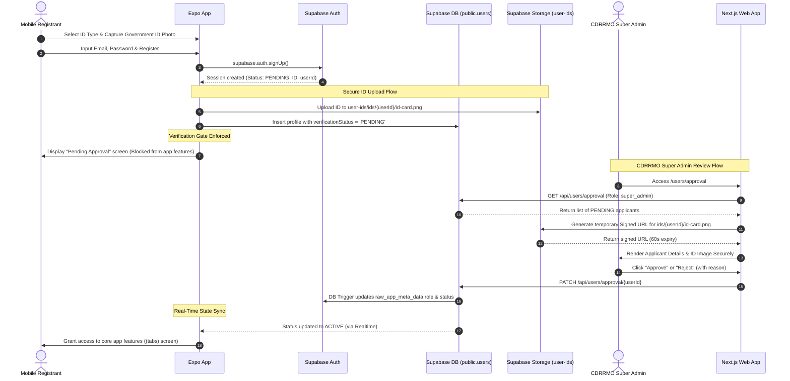

# Feature Spec 21: CDRRMO ID Validation & Storage

## Overview

This specification defines the secure storage, validation, and manual approval workflow for mobile user registrations (Public Users and Ambulance Responders) in DisasTRACE. In alignment with recent security and organizational changes, the authority to verify user registrations is **strictly reallocated to the CDRRMO Super Admin** instead of the PACC Admin. 

To support secure verification, a dedicated **private Supabase Storage bucket** (`user-ids`) will be established to house government ID uploads. Only the uploading user (during their registration session) and the CDRRMO Super Admin (for review) will have access to these files.

---

## 1. System Roles & Access Model (/plan-writing)

The ID upload and validation process coordinates three system roles as follows:

| Role | Responsibility in ID Validation | Storage Bucket Permissions | Web/Mobile Interface |
| :--- | :--- | :--- | :--- |
| **Public User / Responder** <br>`(mobile)` | Captures and uploads a photo of their Government ID during step 3 of registration. | **INSERT** (own path: `ids/{uid}/*`) <br>**SELECT** (own path: `ids/{uid}/*`) | Expo Sign-Up Wizard & <br>Verification Gate screens |
| **CDRRMO Super Admin** <br>`(web)` | Reviews pending applicants, inspects IDs, and either Approves or Rejects the application. | **SELECT** (all objects in `user-ids` bucket) | Next.js Web Portal: <br>`/users/approval` |
| **PACC Admin** <br>`(web)` | **None.** Dismissed from registration approvals to focus strictly on dispatching and active incident triage. | **None** (No read or write access) | No access to `/users/approval` or related APIs |

### Registration & Validation Workflow


---

## 2. Secure File Storage & API Infrastructure (/backend-architect)

### 2.1 Private Supabase Storage Bucket Setup
A new, private bucket named `user-ids` must be created. **Public access is strictly disabled.**

#### Storage Directory Structure:
```
user-ids/
└── ids/
    └── {userId}/
        └── id-card.png
```

#### Row Level Security (RLS) Policies on `storage.objects`:
To enforce absolute security, the following policies will be applied to the `storage.objects` table:

1. **INSERT Policy (Self-Upload on Registration)**:
   - **Name**: `Allow authenticated users to upload their own ID`
   - **Check**: `bucket_id = 'user-ids' AND auth.uid()::text = (storage.foldername(name))[2]`
   - **Operation**: `INSERT`

2. **SELECT Policy (Self-View on Mobile)**:
   - **Name**: `Allow users to view their own ID`
   - **Check**: `bucket_id = 'user-ids' AND auth.uid()::text = (storage.foldername(name))[2]`
   - **Operation**: `SELECT`

3. **SELECT Policy (Super Admin Review)**:
   - **Name**: `Allow Super Admin to view all user IDs`
   - **Check**: `bucket_id = 'user-ids' AND auth.jwt() -> 'app_metadata' ->> 'role' = 'cdrrmo_super_admin'`
   - **Operation**: `SELECT`

```sql
-- SQL script to initialize bucket and policies in Supabase
insert into storage.buckets (id, name, public, file_size_limit, allowed_mime_types)
values (
  'user-ids', 
  'user-ids', 
  false, 
  26214400, -- 25MB in bytes
  array['image/jpeg', 'image/png']
)
on conflict (id) do nothing;

-- Enable RLS on storage.objects if not already enabled
alter table storage.objects enable row level security;

-- Create Policies
create policy "Allow self-upload" on storage.objects
  for insert with check (
    bucket_id = 'user-ids' 
    and (storage.foldername(name))[1] = 'ids'
    and auth.uid()::text = (storage.foldername(name))[2]
  );

create policy "Allow self-view" on storage.objects
  for select using (
    bucket_id = 'user-ids'
    and (storage.foldername(name))[1] = 'ids'
    and auth.uid()::text = (storage.foldername(name))[2]
  );

create policy "Allow Super Admin view all" on storage.objects
  for select using (
    bucket_id = 'user-ids'
    and auth.jwt() -> 'app_metadata' ->> 'role' = 'cdrrmo_super_admin'
  );
```

> [!IMPORTANT]  
> PACC Admins (`pacc_admin`) do not possess any storage policy permissions on the `user-ids` bucket. Any attempt by a PACC Admin to read from or write to this bucket will result in a database-level access denial.

### 2.2 Database Schema Alignment (`db/schema/users.ts`)
The `public.users` table schema stores verification credentials directly:
```typescript
import { pgTable, text, varchar, timestamp } from 'drizzle-orm/pg-core';

export const users = pgTable('users', {
  id: varchar('id', { length: 255 }).primaryKey(), // Supabase Auth ID (UUID)
  fullName: text('full_name').notNull(),
  email: text('email').notNull().unique(),
  phone: varchar('phone', { length: 20 }),
  address: text('address'),
  role: text('role', { enum: ['public_user', 'ambulance_responder', 'pacc_admin', 'cdrrmo_super_admin'] }).notNull(),
  status: text('status', { enum: ['ACTIVE', 'SUSPENDED', 'DEACTIVATED', 'PENDING'] }).default('PENDING').notNull(),
  verificationStatus: text('verification_status', { enum: ['PENDING', 'APPROVED', 'REJECTED'] }).default('PENDING').notNull(),
  rejectionReason: text('rejection_reason'),
  idType: text('id_type'),
  idImageUrl: text('id_image_url'), // Stores the path string e.g. "ids/{userId}/id-card.png"
  createdAt: timestamp('created_at').defaultNow().notNull(),
  updatedAt: timestamp('updated_at').defaultNow().notNull(),
});
```

### 2.3 REST API Endpoints (`app/api/users/approval/`)
Endpoints will be secured using `@supabase/ssr` role checks, returning a `403 Forbidden` for anyone other than `cdrrmo_super_admin`.

#### `GET /api/users/approval`
- **Access**: `cdrrmo_super_admin` only.
- **Responsibility**: Queries `public.users` where `verificationStatus = 'PENDING'`. 
- **Security Action**: For each pending applicant, the server generates a secure, short-lived signed URL for their ID card and sends it in the payload.
- **Code implementation concept**:
```typescript
import { NextResponse } from "next/server";
import { createClient } from "@/lib/supabase";
import { db } from "@/db";
import { users } from "@/db/schema/users";
import { eq } from "drizzle-orm";

export async function GET() {
  const supabase = await createClient();
  const { data: { user } } = await supabase.auth.getUser();

  if (user?.app_metadata?.role !== 'cdrrmo_super_admin') {
    return new NextResponse(JSON.stringify({ error: "Unauthorized" }), { status: 403 });
  }

  // Fetch pending applicants
  const pendingUsers = await db
    .select()
    .from(users)
    .where(eq(users.verificationStatus, 'PENDING'));

  // Generate short-lived signed URLs (e.g., 60 seconds expiry)
  const applicants = await Promise.all(
    pendingUsers.map(async (u) => {
      let signedUrl = "";
      if (u.idImageUrl) {
        const { data } = await supabase.storage
          .from('user-ids')
          .createSignedUrl(u.idImageUrl, 60);
        signedUrl = data?.signedUrl || "";
      }

      return {
        id: u.id,
        fullName: u.fullName,
        email: u.email,
        phone: u.phone,
        address: u.address,
        roleRequested: u.role,
        status: u.verificationStatus,
        identityDocument: {
          type: u.idType || "Unknown",
          imageUrl: signedUrl,
          uploadedAt: u.createdAt.toISOString(),
        },
        registeredAt: u.createdAt.toISOString(),
      };
    })
  );

  return NextResponse.json({
    applicants,
    summary: {
      pending: applicants.length,
      reviewedToday: 0, // In production, query audit/logs table
    }
  });
}
```

#### `PATCH /api/users/approval/[id]`
- **Access**: `cdrrmo_super_admin` only.
- **Responsibility**: Updates user verification and active status.
- **Trigger Sync**: Triggers the Postgres trigger `on_user_role_sync` to automatically propagate role updates to `auth.users` raw app metadata to instantly enable JWT claims on the mobile app.
- **Zod Schema Payload**:
```typescript
import { z } from "zod";
export const VerificationActionSchema = z.object({
  status: z.enum(["APPROVED", "REJECTED"]),
  reason: z.string().optional(),
});
```

---

## 3. Web Dashboard Updates (/frontend-developer)

### 3.1 Navigation Restructuring
The manual approval workspace is shifted from the dispatcher's dashboard to the Super Admin control panel.

#### `lib/navigation.ts` Update:
`Users Approval` is deleted from `PACC_NAV` and added into `CDRRMO_NAV`.

```diff
 export const CDRRMO_NAV: NavItem[] = [
   {
     title: "Dashboard",
     url: "/dashboard",
     icon: LayoutGrid,
   },
   ...
   {
     title: "User Management",
     url: "/users",
     icon: Users,
   },
+  {
+    title: "Users Approval",
+    url: "/users/approval",
+    icon: UserPlus,
+  },
   {
     title: "Responder Roster",
     url: "/roster",
     icon: UserCheck,
   },
   ...
 ]

 export const PACC_NAV: NavItem[] = [
   {
     title: "Dashboard",
     url: "/dashboard",
     icon: LayoutGrid,
   },
   {
     title: "Map",
     url: "/map",
     icon: MapIcon,
   },
   {
     title: "Status & Logs",
     url: "/logs",
     icon: Folder,
   },
   {
     title: "Verification",
     url: "/verification",
     icon: ShieldCheck,
   },
-  {
-    title: "Users Approval",
-    url: "/users/approval",
-    icon: UserPlus,
-  },
 ]
```

### 3.2 Middleware / Edge Protection (`proxy.ts`)
The Edge Middleware will block PACC Admins from directly navigating to `/users/approval`.
```typescript
// Insert verification check inside proxy.ts
if (request.nextUrl.pathname.startsWith("/users/approval")) {
  if (role !== "cdrrmo_super_admin") {
    return NextResponse.redirect(new URL("/unauthorized-platform", request.url));
  }
}
```

### 3.3 Visual & High-Fidelity UI Guidelines
The page `/users/approval` retains its optimized Master-Detail visual design but uses strictly authenticated signed URLs:
- **Queue Layout**: Subtly shaded sidebar list panel for pending registrations, separating them clearly from the white details content pane.
- **Secure ID Viewer**: Render images using the short-lived signed URLs. Implement click-to-enlarge overlays. Add a prominent `"CONFIDENTIAL: REVIEW ONLY"` badge over the ID viewer.
- **Branding**: Implements the `Inter` font, Navy Blue (`#1E3A8A`) action buttons for account approval, and critical orange-red tones for triggering rejection dialog sheets.

---

## 4. Mobile Expo Integration (/mobile-developer)

### 4.1 Image Capture and Secure Upload (Sign-Up Step 3/4)
When a user selects a government ID and submits their details, the mobile app performs a multipart upload to the private storage bucket.

To prevent memory leaks and upload failures on React Native, the image must be converted to an array buffer from a local file URI:

```typescript
import * as FileSystem from 'expo-file-system';
import { decode } from "base64-arraybuffer";
import { supabase } from "@/lib/supabase";

export async function uploadGovernmentID(userId: string, imageUri: string): Promise<string> {
  // Compress ID image using expo-image-manipulator or similar, and verify < 25MB limit
  const fileInfo = await FileSystem.getInfoAsync(imageUri);
  if (!fileInfo.exists) throw new Error("Image file does not exist.");
  if (fileInfo.size > 25 * 1024 * 1024) throw new Error("ID photo exceeds 25MB limit.");

  // Convert local file to base64 and decode to ArrayBuffer
  const base64 = await FileSystem.readAsStringAsync(imageUri, {
    encoding: FileSystem.EncodingType.Base64,
  });
  const arrayBuffer = decode(base64);

  const filePath = `ids/${userId}/id-card.png`;

  const { data, error } = await supabase.storage
    .from('user-ids')
    .upload(filePath, arrayBuffer, {
      contentType: 'image/png',
      upsert: true,
    });

  if (error) {
    throw new Error(`Storage upload failed: ${error.message}`);
  }

  return filePath; // Return file path to store in database idImageUrl field
}
```

### 4.2 Verification Gate & App Routing (`mobile/app/_layout.tsx`)
After logging in, the mobile application intercepts the user's progress using a navigation gate to examine their registration approval status.

- **Check Frequency**: Checked upon session initial load, and refreshed via real-time hook.
- **Routing Rules**:
  - `verification_status === 'APPROVED'`: Automatically routes the user into the main interface (`(tabs)`).
  - `verification_status === 'PENDING'`: Routes user to the non-bypassable `(verification)/pending` screen.
  - `verification_status === 'REJECTED'`: Routes user to `(verification)/rejected`, rendering the admin's `rejection_reason` and providing a form wizard trigger to re-upload their ID card image and re-submit the profile.

```typescript
// Verification gate routing conceptual implementation
import { useEffect } from 'react';
import { useRouter, useSegments } from 'expo-router';
import { useAuthStore } from '@/store/auth-store'; // Zustand store mapping profile

export function useVerificationGate() {
  const { userProfile, loading } = useAuthStore();
  const segments = useSegments();
  const router = useRouter();

  useEffect(() => {
    if (loading || !userProfile) return;

    const inAuthGroup = segments[0] === '(auth)';
    const inVerificationGroup = segments[0] === '(verification)';

    const status = userProfile.verificationStatus;

    if (status === 'PENDING') {
      if (segments[0] !== '(verification)' || segments[1] !== 'pending') {
        router.replace('/(verification)/pending');
      }
    } else if (status === 'REJECTED') {
      if (segments[0] !== '(verification)' || segments[1] !== 'rejected') {
        router.replace('/(verification)/rejected');
      }
    } else if (status === 'APPROVED') {
      if (inAuthGroup || inVerificationGroup) {
        router.replace('/(tabs)');
      }
    }
  }, [userProfile, segments, loading]);
}
```

---

## 5. Design & Security Alignment Checklist

- [ ] Private Supabase Storage bucket `user-ids` created with public access disabled.
- [ ] Row Level Security (RLS) policies set up for `storage.objects` limiting write/read to only file owners and `cdrrmo_super_admin`.
- [ ] Navigation sidebar configurations updated (`lib/navigation.ts`): "Users Approval" deleted from PACC Admin and integrated into CDRRMO Super Admin menu.
- [ ] REST API endpoints `/api/users/approval/` protected via backend verification, strictly permitting only `cdrrmo_super_admin` access (403 returned for others).
- [ ] Next.js Edge Middleware (`proxy.ts`) updated to reject non-super-admins trying to access `/users/approval`.
- [ ] ID viewer inside Next.js frontend refactored to fetch secure, 60-second temp signed URLs instead of public database path urls.
- [ ] Mobile Expo registration wizard (Step 3/4) converts and uploads captured images to private bucket path `ids/{userId}/id-card.png` using ArrayBuffer decoder before creating database profile.
- [ ] Mobile Verification Gate configured to intercept unapproved users, routing them to the non-bypassable `(verification)/pending` or `(verification)/rejected` screens.
- [ ] Rejection page (`(verification)/rejected`) displays the detailed administrator's rejection reason and supports image re-uploading capability for account correction.
