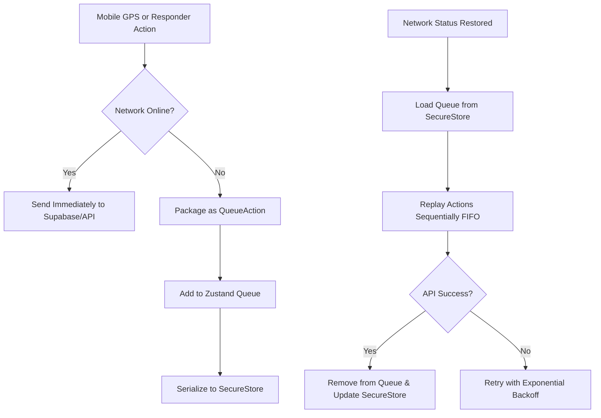

# Offline Mobile State Buffer & Telemetry Queue Implementation Plan

**Goal:** Provide fault tolerance for mobile responders navigating cellular blindspots. This system caches crucial ambulance state transitions (`ARRIVED`, `TRANSPORTING`, `RESOLVED`) and location updates in a local persistent queue (`Zustand` and `SecureStore`) during dropouts, replaying them chronologically (FIFO) once connectivity is restored.

---

## Technical Architecture



### 1. Queue Action Structure
We define a serialized transaction contract in `mobile/stores/useResponderStore.ts`:

```typescript
export interface QueueAction {
  id: string; // unique transaction uuid/timestamp
  type: 'STATE_CHANGE' | 'TELEMETRY_SYNC';
  timestamp: string; // ISO string to maintain audit trail sequence
  endpoint: string; // API URL to target
  method: 'POST' | 'PATCH' | 'PUT';
  payload: any; // payload parameters
}
```

---

## Phased Implementation Plan

### Task 1: Extend State Store & Offline Queue Persistence
Add local buffering state and queue modifiers in the global state manager [useResponderStore.ts](file:///D:/dev/freelance/disas_trace/mobile/stores/useResponderStore.ts).

**Steps:**
1. Declare state types:
   * `offlineQueue: QueueAction[]`
   * `isSyncingQueue: boolean`
2. Implement actions:
   * `enqueueAction(action: Omit<QueueAction, 'id' | 'timestamp'>)`: Adds an action, assigns ID and timestamp, and writes to `SecureStore` for persistent durability.
   * `dequeueAction(id: string)`: Removes the action and updates `SecureStore`.
   * `loadOfflineQueue()`: Hydrates the store queue from `SecureStore` on app mount.
3. Optimize telemetry entries:
   * Coordinate logs are prone to bloat. When adding a `TELEMETRY_SYNC` action, search the queue. If a `TELEMETRY_SYNC` already exists, update its payload with the latest coordinates instead of appending a new item. This merges updates to save bandwidth and prevent database write storms post-recon.

---

### Task 2: Intercept Actions with Connection State Gates
Update active trigger commands in the mobile app to handle offline states.

**Files:**
* Modify: [useResponderStore.ts](file:///D:/dev/freelance/disas_trace/mobile/stores/useResponderStore.ts)
* Modify: [use-broadcast-tracker.ts](file:///D:/dev/freelance/disas_trace/mobile/hooks/use-broadcast-tracker.ts)

**Steps:**
1. Inside `arriveAtScene` and `startReport` actions:
   * Read the global `isOnline` state (provided by our existing net hook).
   * **If Offline**: Avoid firing `supabase.from('incidents').update()`. Instead, immediately transition the UI locally (e.g., transition `status` to `'on_scene'` or `'report_filling'` so the responder is never blocked) and enqueue the status update action:
     ```typescript
     enqueueAction({
       type: 'STATE_CHANGE',
       endpoint: '/api/incidents/status',
       method: 'POST',
       payload: { incidentId: activeDispatch.id, status: 'ARRIVED' }
     });
     ```
2. Inside `useBroadcastTracker` (GPS Broadcast Loop):
   * **If Offline**: Skip REST `fetch` triggers. Instead, invoke a throttled `enqueueAction` for telemetry sync:
     ```typescript
     enqueueAction({
       type: 'TELEMETRY_SYNC',
       endpoint: '/api/responder/location',
       method: 'POST',
       payload: { latitude: lat, longitude: lng }
     });
     ```

---

### Task 3: FIFO Replay & Synchronization Engine
Develop an automated queue processing engine that triggers on connection recovery.

**Files:**
* Modify: [use-offline-reports.ts](file:///D:/dev/freelance/disas_trace/mobile/hooks/use-offline-reports.ts)

**Steps:**
1. Extend `useOfflineReports` to observe the queue in addition to reports drafts.
2. When the device transitions to `online`:
   * Fetch the hydrated `offlineQueue` from the store.
   * Iterate over the items sequentially (FIFO):
     1. Retrieve the authenticated Supabase session token.
     2. Dispatch the HTTP fetch request matching the `method`, `endpoint`, and `payload` properties.
     3. On HTTP 200/201 success: Dequeue the processed action from the state store and persistent storage.
     4. On failure (e.g., HTTP 500 or timeout): Pause queue execution, apply an exponential backoff delay (1s, 2s, 4s), and attempt retry up to 3 times before deferring to prevent crash loops.
3. Trigger a light tactile success haptic warning using `expo-haptics` once all pending actions are fully flushed and synced.

---

### Task 4: UI HUD Indicator & Transition Verification
Enhance dispatcher maps and responder UI to provide intuitive network feedback.

**Files:**
* Modify: [OfflineBanner.tsx](file:///D:/dev/freelance/disas_trace/mobile/components/dashboard/OfflineBanner.tsx)
* Modify: [tracking.tsx](file:///D:/dev/freelance/disas_trace/mobile/app/help/tracking.tsx)

**Steps:**
1. Integrate the `isSyncingQueue` state inside `OfflineBanner.tsx`.
2. When the network is restored and synchronization is active, display a spinning syncing icon and updated copy:
   * `"Syncing 3 pending updates..."` instead of a static green bar.
   * Reverts to regular green `"Connection Restored"` only when the queue length is exactly `0`.
3. Verify type safety on both platforms:
   ```bash
   # Next.js workspace
   npx tsc --noEmit
   # Expo mobile workspace
   cd mobile && npx tsc --noEmit
   ```

---

## Benefits & Trade-offs

### Pros:
1. **Uninterrupted Operations**: Responders can perform scene arrivals and clinical actions completely offline; the app transitions screen states seamlessly.
2. **Audit Log Chronology**: State changes are timestamped at the exact moment they were tapped (rather than when they reached the server), preserving precise response-time audits.
3. **Robust Data Preservation**: Cache survives OS memory collection or battery depletion since transactions write to SecureStore instantly.

### Cons / Trade-offs:
1. **PACC Stale Map Telemetry**: While the ambulance is in a blindspot, PACC dispatchers and waiting residents will see the vehicle marker freeze. Once online, the marker will jump to the latest synchronized position. (This is physically unavoidable but mitigated by providing resident-side status updates like "Ambulance Arrived" retroactively).
