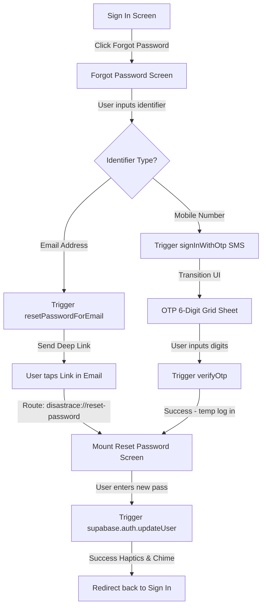

# Mobile Forgot Password Recovery Implementation Plan

**Goal:** Implement a secure, robust, and visually gorgeous "Forgot Password" flow inside the mobile application. This system supports both **Email Password Reset (via Deep-Linking)** and **SMS OTP Password Reset (via mobile verification codes)**, covering both residents and responders who register using emails or mobile numbers.

---

## Technical Architecture & Dual-Recovery Flow



---

## Tech Stack & Configurations
- **Framework**: Expo Router (v6+), React Native, TailwindCSS / NativeWind.
- **Backend Service**: Supabase Auth (OTP and Password Reset templates).
- **Deep Linking**: Expo Linking API (`expo-linking`).
- **Icons & Vibrations**: `iconsax-react-native`, `expo-haptics`.

---

## Phased Implementation Plan

### Task 1: deep-linking Setup in Expo Config
Enable the mobile application to listen to and resolve deep links (`disastrace://`).

**Files:**
* Modify: `mobile/app.json` (or verify scheme config)
* Modify: `mobile/app/_layout.tsx` (configure linking routing)

**Steps:**
1. Open `mobile/app.json` and ensure the application scheme is registered under a custom protocol (e.g. `disas-trace` or `disastrace`):
   ```json
   {
     "expo": {
       "scheme": "disastrace",
       "extra": {
         "supabaseUrl": "...",
         "supabaseAnonKey": "..."
       }
     }
   }
   ```
2. Configure Expo Router linking rules inside `mobile/app/_layout.tsx` to automatically redirect users navigating from `disastrace://(auth)/reset-password` into the proper route.

---

### Task 2: Create "Forgot Password" Recovery Screen
Add a premium, high-fidelity screen [forgot-password.tsx](file:///D:/dev/freelance/disas_trace/mobile/app/%28auth%29/forgot-password.tsx) where users input their identifier and receive their recovery challenge.

**Files:**
* Create: `mobile/app/(auth)/forgot-password.tsx`
* Modify: [sign-in.tsx](file:///D:/dev/freelance/disas_trace/mobile/app/%28auth%29/sign-in.tsx) (wire up the Link click)

**UI & Logic Specifications:**
1. Renders a beautiful matching Navy Blue gradient background (`['#0A1332', '#15286A']`) with the DisasTRACE emblem.
2. Accepts input identifier (email or mobile).
3. **Email Validation**:
   - On submit, fire:
     ```typescript
     await supabase.auth.resetPasswordForEmail(email, {
       redirectTo: 'disastrace://(auth)/reset-password'
     });
     ```
   - Transition UI to show a pulsing checkmark: `"Reset link successfully dispatched to email. Please check your inbox."`
4. **Mobile OTP SMS Validation**:
   - If input starts with `+` or contains only digits, parse as phone number and dispatch SMS OTP:
     ```typescript
     await supabase.auth.signInWithOtp({ phone });
     ```
   - Dynamically slide up an absolute **6-digit numerical entry sheet** with autofocus cells, tactile feedback vibrations on digit click, a 60-second cooldown resend countdown, and error check indicators.
   - Upon completing the 6 digits, verify the OTP:
     ```typescript
     const { error } = await supabase.auth.verifyOtp({
       phone,
       token: otpCode,
       type: 'sms'
     });
     ```
   - If verification succeeds, navigate directly to `/(auth)/reset-password`.

---

### Task 3: Create "Reset Password" Screen
Add the secure screen where users input and commit their new password.

**Files:**
* Create: `mobile/app/(auth)/reset-password.tsx`

**UI & Logic Specifications:**
1. Renders password inputs with standard Eye/EyeSlash visibility toggle icons.
2. Implements strict Zod validation rules:
   * Minimum **8 characters** long.
   * Contains at least one **uppercase letter**.
   * Contains at least one **special character** (`@`, `$`, `!`, `%`, etc.).
3. On submit, trigger the Supabase user credentials update:
   ```typescript
   const { error } = await supabase.auth.updateUser({
     password: newPassword
   });
   ```
4. **Visual Polish**:
   - On success, trigger success haptic feedback and display a premium modal containing a green glowing shield check animation.
   - Run a 3-second automatic navigation sequence that logs the user out (to reset sessions) and redirects them cleanly back to the `/(auth)/sign-in` portal.

---

### Task 4: Integration Review & Compilation
Verify build health, compilation, and absolute compile safety.

**Steps:**
1. Run static checks on both workspaces:
   ```bash
   # Expo Mobile Project
   cd mobile && npx tsc --noEmit
   # Next.js Web Project
   npx tsc --noEmit
   ```
2. Ensure no standard React Hook or Expo router deep-linking variables throw TypeScript violations.
